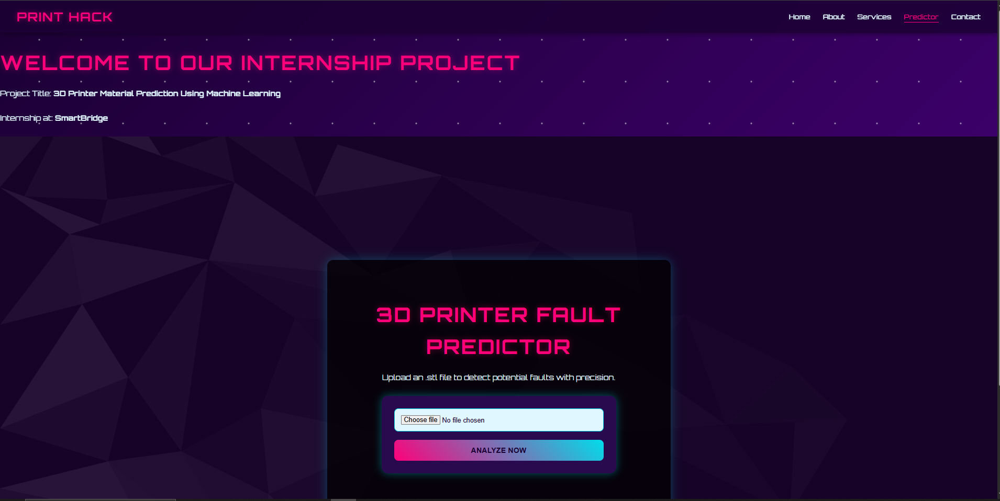

# 3D Model Fault Prediction Using Machine Learning by the Help of Coordinates

## 📌 Project Overview

This project predicts **faults in a 3D model** using sensor data and coordinates with the help of **Machine Learning**. It combines a Jupyter Notebook for data processing, a Python backend (`app.py`), HTML templates for the user interface, and static assets like images, CSS, and video demos.

---

## 🎯 **Key Features**

- 📈 **Collects coordinate data** from sensors (e.g., ADXL345).
- 🧠 **Trains a ML model** to predict faults or anomalies.
- ⚙️ **Web interface** built with Flask (Python) and HTML/CSS.
- 📊 **Jupyter Notebook** for data cleaning, EDA, and model building.
- 📂 **Includes**: Python scripts, HTML templates, CSS, video, and trained model.

---

## 🗂️ **Project Structure**

.
├── LP3_3D_Printer.ipynb # Jupyter Notebook for ML workflow
├── app.py # Flask web application
├── model.pkl # Saved ML model
├── ADXL345_SensorData.csv # Sensor coordinate data
├── static/ # Static files (CSS, images, videos)
├── templates/ # HTML templates for web pages
└── README.md # This file

---

## ⚙️ **How to Run**

1️⃣ **Clone the repository**

git clone https://github.com/Namangauttam/3D-Model-Fault-Prediction-Using-Machine-Learning-by-the-help-of-coordinate.git
cd 3D-Model-Fault-Prediction-Using-Machine-Learning-by-the-help-of-coordinate
2️⃣ Create a virtual environment (optional but recommended)

python -m venv venv
venv\Scripts\activate   # Windows
source venv/bin/activate  # Linux/Mac
3️⃣ Install dependencies

pip install -r requirements.txt
(Make sure you create requirements.txt if you haven’t yet!)

4️⃣ Run the Flask app

python app.py
5️⃣ Open in browser

http://127.0.0.1:5000/

📊 Model Notebook
Use LP3_3D_Printer.ipynb for:
->Data analysis
->Visualization
->Model training/testing

🎥 Demo video link :->                   https://drive.google.com/file/d/1Yu-mxnEBFl_n4m-vTiitvLXg-k_87Gbk/view?usp=sharing
